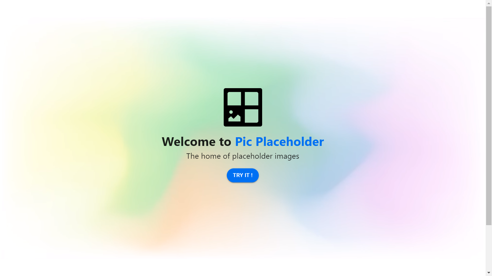
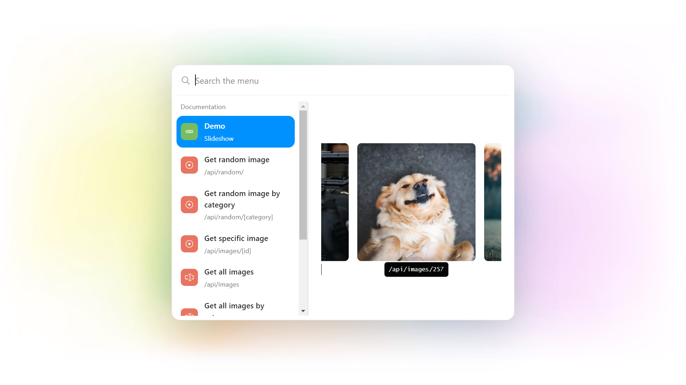
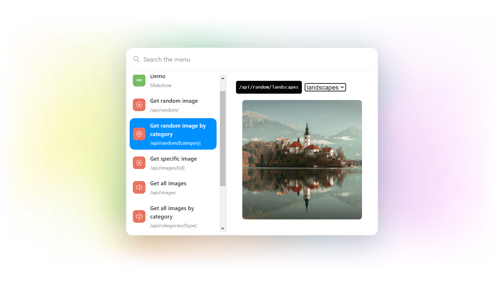
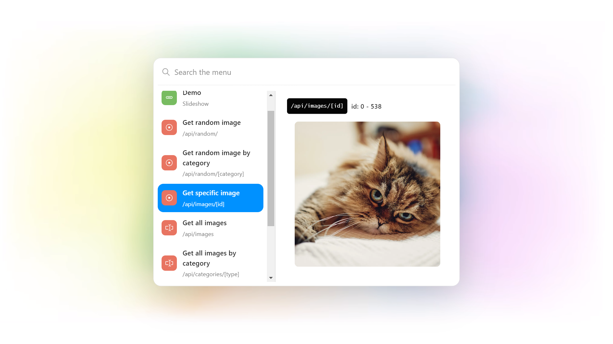
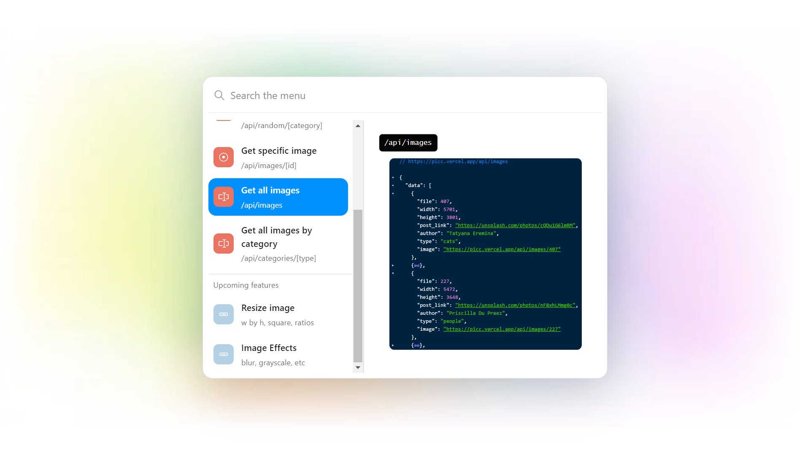
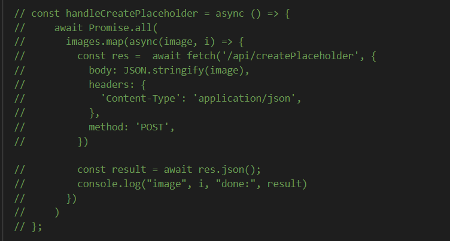
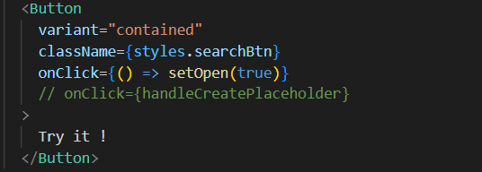

# 🖼️ Pic Placeholder

Pic placeholder is a stylish image placeholder with 6 categories (animals, cats, dogs, houses, landscapes & people) which collectively sums up to 500+ images.












# Overview video

Here's a short video that explains the project and how it uses redis:
[](https://youtu.be/Ji_q9ZADONE)

## How it works

Pic placeholder is a microservice that provides endpoints to get placeholder images. These endpoints are:

- `/api/categories/[type]`
  - returns JSON of all images with the supported types filtered from redis
- `/api/images/[id]`
  - redirects to specific image stored on aws S3
- `/api/images`
  - returns JSON of all images from redis
- `/api/random/[category]`
  - redirects to a random image matching the category
- `/api/random`
  - redirects to a random image

### How the data is stored:

There are two parts to this; the Redis JSON storage and the aws s3 storage.

- The Redis JSON contains the placeholders which are of this schema:

  ```
  {
      file: { type: "number" },
      width: { type: "number" },
      height: { type: "number" },
      post_link: { type: "string" },
      author: { type: "string" },
      type: { type: "text" },
    },
  ```

  - file: name of the image in s3
  - widht, height: original image dimensions
  - post_link: location of unsplash image location
  - author: unsplash image creator's name
  - type: one of the categories
- S3 storage: This is where the actual image files are stored referencing the **file** field from the above schema.

### How the data is accessed:

This is how the data is accessed for each endpoint using the two storage providers above:

- `/api/categories/[type]`
  - This returns a JSON, so it goes to the redis, uses redis search to filter the json data by provided category, it's JSON is then updated to point to the location of each individual object and is then returned
    ```js
    // temp being the schema above,
          return {
            ...temp,
            image: `https://picc.vercel.app/api/images/${temp.file}`
          }

    ```
- `/api/images/[id]`
  - This maps the incoming request path to the s3 bucket path that points to `id.jpg` in the bucket. i.e `https://picc.vercel.app/api/images/1` => `https://bucket_url/images/1.jpg`
- `/api/images`
  - This returns a JSON of all placeholders stored in redis with alterations like the first endpoint above.
- `/api/random/[category]`
  - This takes the category as a query and searches redis just like `/api/categories/[type]` with an added step of picking a random image from the returned array and returns a response redirect
- `/api/random`
  - This picks a random value from the range of the image collection (0-538) and then appends it the image location url as a redirect. i.e:
    ```js
    res.redirect(`https://picc.vercel.app/api/images/${file}`)
    ```

## How to run it locally?

### Prerequisites

- Node (min. v14)

### Local installation

We're going to be doing the following:

- Use Unsplash API to get Images
- Use Node JS to generate the JSON & download the images
- Use AWS S3 to store the image files
- Use Redis to store the JSON files
- Integrate it all with our next app

#### Use Unsplash API

- I used this to generate the JSON files and the first step is get an unsplash api key, more information can be found in this [link](https://github.com/khwilo/unsplash-images-json)
- After following all the steps in the Getting started section of the readme, continue below

#### Use Node JS to generate the JSON & download the image

- Now while still in the `unsplash-images-json project`, replace the content of the `index.js`with this:

```js
require('dotenv').config();
const fs = require('fs');
const nodeFetch = require('node-fetch');
const path = require('path');
const prompt = require('prompt-sync')();
const { createApi } = require('unsplash-js');

const { shuffleArray } = require('./utils');

const dataDirectory = path.resolve(__dirname, '..', 'data'); // save photos JSON files here
const jsonFilePath = (name) => path.join(dataDirectory, name);

if (!fs.existsSync(dataDirectory)) {
  fs.mkdirSync(dataDirectory);
}

// Create an instance of the Unsplash API
const unsplash = createApi({
  accessKey: process.env.ACCESS_KEY,
  fetch: nodeFetch,
});

// Search for photos
async function fetchPhotos(query, transformResult, page) {
  try {
    const data = await unsplash.search.getPhotos({
      query,
      page: page,
      perPage: 30,
      orientation: 'landscape',
    });
    if (data.errors) {
      console.log('[FETCHING PHOTOS ERROR]: ', data.errors[0]);
    } else {
      const { results } = data.response;
      const output = transformResult
        ? results.map((result) => {
          return {
              file: result.id,
              width: result.width,
              height: result.height,
              img: result.urls.full,
              post_link: result.links.html,
              author: result.user.name,
            };
          })
        : results;
      console.log(`Finished fetching ${query} photos!`);
      return output;
    }
  } catch (error) {
    console.log('[ERROR OCCURRED]: ', error);
  }
}

// Fetch various photos
async function fetchListOfVariousPhotos(query, transform) {
  try {
    const fetchedResults = [];

    fetchedResults.push(fetchPhotos(query.term, transform, query.page));

    const results = await Promise.all(fetchedResults);
    const list = [].concat.apply([], results);

    const shuffledList = [...list]; // create a copy of the list of photos
    shuffleArray(shuffledList); // Shuffle the list of photos

    fs.createWriteStream(jsonFilePath(query.name)).write(
      JSON.stringify(shuffledList, null, 2)
    );
  } catch (error) {
    console.log('[FETCHING VARIOUS PHOTOS ERROR]: ', error);
  }
}

// Example search terms: architecture, textures patterns, galaxy
const searchTerm = prompt(
  'Enter any word to start process: '
);

if (searchTerm) {
  const qq = [
    {
      term: 'animals',
      name: 'animals.json',
      page: 1
    },
    {
      term: 'animals',
      name: 'animals2.json',
      page: 2
    },
    {
      term: 'animals',
      name: 'animals3.json',
      page: 3
    },

    {
      term: 'cats',
      name: 'cats.json',
      page: 1
    },
    {
      term: 'cats',
      name: 'cats2.json',
      page: 2
    },
    {
      term: 'cats',
      name: 'cats3.json',
      page: 3
    },

    {
      term: 'dogs',
      name: 'dogs.json',
      page: 1
    },
    {
      term: 'dogs',
      name: 'dogs2.json',
      page: 2
    },
    {
      term: 'dogs',
      name: 'dogs3.json',
      page: 3
    },

    {
      term: 'people',
      name: 'people.json',
      page: 1
    },
    {
      term: 'people',
      name: 'people2.json',
      page: 2
    },
    {
      term: 'people',
      name: 'people3.json',
      page: 3
    },

    {
      term: 'houses',
      name: 'houses.json',
      page: 1
    },
    {
      term: 'houses',
      name: 'houses2.json',
      page: 2
    },
    {
      term: 'houses',
      name: 'houses3.json',
      page: 3
    },

    {
      term: 'landscapes',
      name: 'landscapes.json',
      page: 1
    },
    {
      term: 'landscapes',
      name: 'landscapes2.json',
      page: 2
    },
    {
      term: 'landscapes',
      name: 'landscapes3.json',
      page: 3
    },
  ]

  qq.forEach((query) => fetchListOfVariousPhotos(query, true) )

  
}

```

Running the above with `yarn start`effectively generates  the 500+ JSON used for this project.

- The next step after the generation is done is to alter the JSON to match the schema defined in the earlier sections and download the images using this script:

```js
const fs = require('fs'),
  https = require("https"),
  Q = require("q");

const animals1 = require('../data/animals.json')
const animals2 = require('../data/animals2.json')
const animals3 = require('../data/animals3.json')

const cats1 = require('../data/cats.json')
const cats2 = require('../data/cats2.json')
const cats3 = require('../data/cats3.json')

const dogs1 = require('../data/dogs.json')
const dogs2 = require('../data/dogs2.json')
const dogs3 = require('../data/dogs3.json')

const houses1 = require('../data/houses.json')
const houses2 = require('../data/houses2.json')
const houses3 = require('../data/houses3.json')

const landscapes1 = require('../data/landscapes.json')
const landscapes2 = require('../data/landscapes2.json')
const landscapes3 = require('../data/landscapes3.json')

const people1 = require('../data/people.json')
const people2 = require('../data/people2.json')
const people3 = require('../data/people3.json')

let animals = [
  ...animals1,
  ...animals2,
  ...animals3,
]

let cats = [
  ...cats1,
  ...cats2,
  ...cats3,
]

let dogs = [
  ...dogs1,
  ...dogs2,
  ...dogs3,
]

let houses = [
  ...houses1,
  ...houses2,
  ...houses3,
]

let landscapes = [
  ...landscapes1,
  ...landscapes2,
  ...landscapes3,
]

let people = [
  ...people1,
  ...people2,
  ...people3,
]


const addType = (array, category) => {
  return array.map((item) => ({
    ...item,
    type: category
  }))
};

animals = addType(animals, 'animals')
cats = addType(cats, 'cats')
dogs = addType(dogs, 'dogs')
houses = addType(houses, 'houses')
landscapes = addType(landscapes, 'landscapes')
people = addType(people, 'people')

let data = [
  ...animals,
  ...cats,
  ...dogs,
  ...houses,
  ...landscapes,
  ...people,
];

function shuffle(array) {
  let currentIndex = array.length,  randomIndex;

  // While there remain elements to shuffle.
  while (currentIndex != 0) {

    // Pick a remaining element.
    randomIndex = Math.floor(Math.random() * currentIndex);
    currentIndex--;

    // And swap it with the current element.
    [array[currentIndex], array[randomIndex]] = [
      array[randomIndex], array[currentIndex]];
  }

  return array;
}

shuffle(data)

data = data.map((item, i) => ({
  ...item,
  file: i
}))

//create temp image JSONs for next processes
fs.createWriteStream('imagesAlt.json').write(
  JSON.stringify(data, null, 2)
);

function downloadImage(url, filepath) {
  var fileStream = fs.createWriteStream(filepath),
    deferred = Q.defer();

  fileStream
    .on("open", function () {
      https.get(url, function (res) {
        res.on("error", function (err) {
          deferred.reject(err);
        });

        res.pipe(fileStream);
      });
    })
    .on("error", function (err) {
      deferred.reject(err);
    })
    .on("finish", function () {
      deferred.resolve(filepath);
    });

  return deferred.promise;
}


// create images in folder for s3 upload
data.forEach((item, i) => {
  if(m.includes(i)) {
    downloadImage(item.img, `./images/${i}.jpg`)
  }
})

const deleteImgKeyFromObject = (array) => array.map(({img, ...items}) => items)
const newData = deleteImgKeyFromObject(data)

// create image JSONs for redis storage
fs.createWriteStream('images.json').write(
  JSON.stringify(newData, null, 2)
);


```

Running the above with `node main` will generate the necessary JSON and images we need to move forward (might take a while depending on your network and proceessing speed).

#### Use AWS S3 to store the image files

- Now we need to create our S3 bucket, while creating it uncheck this box, for  public access
  
- And after its creation go the bucket `permissions` and update the bucket policy with this JSON:

```json
{
    "Version": "2012-10-17",
    "Statement": [
        {
            "Sid": "AddPerm",
            "Effect": "Allow",
            "Principal": "*",
            "Action": "s3:GetObject",
            "Resource": "arn:aws:s3:::BUCKET_NAME/*"
        }
    ]
}
```

- After that is done click, the upload button and upload the `images` folder from the `unsplash-images-json`project directory.
- Now all images should be publicly readable. **NB**: remeber to store the S3 url for later (you can always come back and get it).

#### Use Redis to store the JSON files

- Firstly we copy the `image.json` from our `unsplash-images-json` project to this project
- Next we create a free database on redis cloud. **NB** rememeber to store password and host for the created db shown in the dashboard for later.

#### Integrate it all with our next app

- Now we do `yarn`or `npm install` to install dependencies
- If you followed the above correctly you should have two variables similar to the `.env-sample` in this project
- Add the variables to your `.env.local`
- Followed by `yarn dev` or `npm dev` to start localhost
- So, Finally we need to add the image placeholders and index them in our redis db:
  - The first step is to run the `handleCreatePlaceholder`in our `index.js`, (currently it's commented out), it can be run by using it as the `onClick` for the `try it` button
  - After the process we index the database by going to this url in our browser; `http://localhost:3000/api/createIndex`





## Deployment

To make deploys work, you need to create free account on [Redis Cloud](https://redis.info/try-free-dev-to)

Be sure to follow all the steps above as well as editing the vercel env variables

Vercel

[](https://vercel.com/new/clone?repository-url=https%3A%2F%2Fgithub.com%2Farndom%2Fpic-placeholder&env=REDIS_URL,S3_URL&envDescription=Redis%20url%20%20in%20this%20format%3A%20redis%3A%2F%2Fdefault%3APASSWORD%40HOST%3APORT%2C%20s3%20url%20in%20this%20format%20%3Ahttps%3A%2F%2FbucketName.s3.region.amazonaws.com)

## More Information about Redis Stack

Here some resources to help you quickly get started using Redis Stack. If you still have questions, feel free to ask them in the [Redis Discord](https://discord.gg/redis) or on [Twitter](https://twitter.com/redisinc).

### Getting Started

1. Sign up for a [free Redis Cloud account using this link](https://redis.info/try-free-dev-to) and use the [Redis Stack database in the cloud](https://developer.redis.com/create/rediscloud).
2. Based on the language/framework you want to use, you will find the following client libraries:
   - [Redis OM .NET (C#)](https://github.com/redis/redis-om-dotnet)
     - Watch this [getting started video](https://www.youtube.com/watch?v=ZHPXKrJCYNA)
     - Follow this [getting started guide](https://redis.io/docs/stack/get-started/tutorials/stack-dotnet/)
   - [Redis OM Node (JS)](https://github.com/redis/redis-om-node)
     - Watch this [getting started video](https://www.youtube.com/watch?v=KUfufrwpBkM)
     - Follow this [getting started guide](https://redis.io/docs/stack/get-started/tutorials/stack-node/)
   - [Redis OM Python](https://github.com/redis/redis-om-python)
     - Watch this [getting started video](https://www.youtube.com/watch?v=PPT1FElAS84)
     - Follow this [getting started guide](https://redis.io/docs/stack/get-started/tutorials/stack-python/)
   - [Redis OM Spring (Java)](https://github.com/redis/redis-om-spring)
     - Watch this [getting started video](https://www.youtube.com/watch?v=YhQX8pHy3hk)
     - Follow this [getting started guide](https://redis.io/docs/stack/get-started/tutorials/stack-spring/)

The above videos and guides should be enough to get you started in your desired language/framework. From there you can expand and develop your app. Use the resources below to help guide you further:

1. [Developer Hub](https://redis.info/devhub) - The main developer page for Redis, where you can find information on building using Redis with sample projects, guides, and tutorials.
2. [Redis Stack getting started page](https://redis.io/docs/stack/) - Lists all the Redis Stack features. From there you can find relevant docs and tutorials for all the capabilities of Redis Stack.
3. [Redis Rediscover](https://redis.com/rediscover/) - Provides use-cases for Redis as well as real-world examples and educational material
4. [RedisInsight - Desktop GUI tool](https://redis.info/redisinsight) - Use this to connect to Redis to visually see the data. It also has a CLI inside it that lets you send Redis CLI commands. It also has a profiler so you can see commands that are run on your Redis instance in real-time
5. Youtube Videos
   - [Official Redis Youtube channel](https://redis.info/youtube)
   - [Redis Stack videos](https://www.youtube.com/watch?v=LaiQFZ5bXaM&list=PL83Wfqi-zYZFIQyTMUU6X7rPW2kVV-Ppb) - Help you get started modeling data, using Redis OM, and exploring Redis Stack
   - [Redis Stack Real-Time Stock App](https://www.youtube.com/watch?v=mUNFvyrsl8Q) from Ahmad Bazzi
   - [Build a Fullstack Next.js app](https://www.youtube.com/watch?v=DOIWQddRD5M) with Fireship.io
   - [Microservices with Redis Course](https://www.youtube.com/watch?v=Cy9fAvsXGZA) by Scalable Scripts on freeCodeCamp
