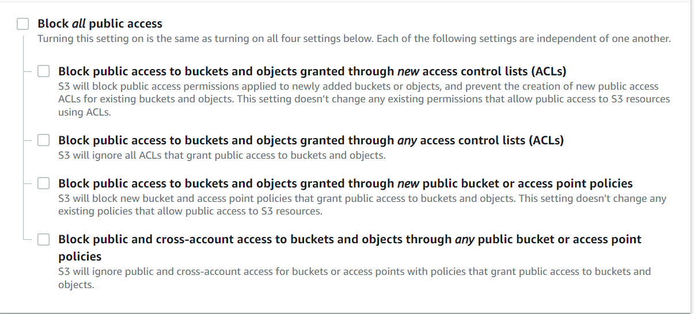

# 🖼️ Pic Placeholder

Pic placeholder is a stylish image placeholder with 6 categories (animals, cats, dogs, houses, landscapes & people) which collectively sums up to 500+ images.

## How it works

Pic placeholder is a microservice that provides endpoints to get placeholder images. These endpoints are:

- /api/categories[type]
  - returns JSON of all images with the supported types filtered from redis
- /api/images/[id]
  - redirect to specific image stored on aws S3
- /api/images
  - returns JSON of all images from redis
- /api/random/[category]
  - redirects to a random image matching the categories
- /api/random
  - redirects to a random image

### How the data is stored:

There are two parts to this; the Redis JSON storage and the aws s3 storage.

- The Redis JSON contains the placeholders which are of this schema:

  ```json
  {
      file: { type: "number" },
      width: { type: "number" },
      height: { type: "number" },
      post_link: { type: "string" },
      author: { type: "string" },
      type: { type: "text" },
    },
  ```

  - file: name of the image in s3
  - widht, height: original image dimensions
  - post_link: location of unsplash image location
  - author: unsplash image creator's name
  - type: one of the categories
- S3 storage: This is where the actual image files are stored referencing the **file** field from the above schema.

### How the data is accessed:

Refer to [this example](https://github.com/redis-developer/basic-analytics-dashboard-redis-bitmaps-nodejs#how-the-data-is-accessed) for a more detailed example of what you need for this section.

## How to run it locally?

[Make sure you test this with a fresh clone of your repo, these instructions will be used to judge your app.]

First off, create a redis cloud account and then a free redis database. Follow the below for more instructions:

To store the images from unsplash, I used this [repo ](https://github.com/khwilo/unsplash-images-json)to generate the JSON, primarily this [index ](https://github.com/khwilo/unsplash-images-json/blob/main/src/index.js)file with some edits for my own schema:

```js
// Search for photos
async function fetchPhotos(query, transformResult, page) {
  try {
    const data = await unsplash.search.getPhotos({
      query,
      page: page,
      perPage: 30,
      orientation: 'landscape',
    });
    if (data.errors) {
      console.log('[FETCHING PHOTOS ERROR]: ', data.errors[0]);
    } else {
      const { results } = data.response;
      const output = transformResult
        ? results.map((result) => {
          return {
              id: result.id,
              width: result.width,
              height: result.height,
              img: result.urls.full,
              post_link: result.links.html,
              author: result.user.name,
            };
          })
        : results;
      console.log(`Finished fetching ${query} photos!`);
      return output;
    }
  } catch (error) {
    console.log('[ERROR OCCURRED]: ', error);
  }
}
```

This JSON is then temporarily copied to the nextjs project and is mapped and called using this endpoint `/api/createPlaceholder`  in this repo with the objects being put in redis. **NB:** remember to enter the value for  `REDIS_URL` as shown `.env-sample` in your `.env.local`

The same generated JSON was then passed to a function which downloaded the images into a folder using this:

```js
const images = require("./images.json");
const fs = require("fs"),
  https = require("https"),
  path = require("path"),
  Q = require("q");

function downloadImage(url, filepath) {
  var fileStream = fs.createWriteStream(filepath),
    deferred = Q.defer();

  fileStream
    .on("open", function () {
      https.get(url, function (res) {
        res.on("error", function (err) {
          deferred.reject(err);
        });

        res.pipe(fileStream);
      });
    })
    .on("error", function (err) {
      deferred.reject(err);
    })
    .on("finish", function () {
      deferred.resolve(filepath);
    });

  return deferred.promise;
}


images.forEach((item, i) => {
  if(m.includes(i)) {
    downloadImage(item.img, `./images/${i}.jpg`)
  }
})
```

- To do this, the above Images are uplaoded to an S3 bucket with the following configurations:
- 

And the bucket policy as this:

```json
{
    "Version": "2012-10-17",
    "Statement": [
        {
            "Sid": "AddPerm",
            "Effect": "Allow",
            "Principal": "*",
            "Action": "s3:GetObject",
            "Resource": "arn:aws:s3:::BUCKET_NAME/*"
        }
    ]
}
```

And these steps enable public read access to object

### Prerequisites

[Fill out with any prerequisites (e.g. Node, Docker, etc.). Specify minimum versions]

### Local installation

[Insert instructions for local installation]

## Deployment

To make deploys work, you need to create free account on [Redis Cloud](https://redis.info/try-free-dev-to)

Vercel

[Insert Deploy on Vercel button](https://vercel.com/docs/deploy-button)

## More Information about Redis Stack

Here some resources to help you quickly get started using Redis Stack. If you still have questions, feel free to ask them in the [Redis Discord](https://discord.gg/redis) or on [Twitter](https://twitter.com/redisinc).

### Getting Started

1. Sign up for a [free Redis Cloud account using this link](https://redis.info/try-free-dev-to) and use the [Redis Stack database in the cloud](https://developer.redis.com/create/rediscloud).
2. Based on the language/framework you want to use, you will find the following client libraries:
   - [Redis OM .NET (C#)](https://github.com/redis/redis-om-dotnet)
     - Watch this [getting started video](https://www.youtube.com/watch?v=ZHPXKrJCYNA)
     - Follow this [getting started guide](https://redis.io/docs/stack/get-started/tutorials/stack-dotnet/)
   - [Redis OM Node (JS)](https://github.com/redis/redis-om-node)
     - Watch this [getting started video](https://www.youtube.com/watch?v=KUfufrwpBkM)
     - Follow this [getting started guide](https://redis.io/docs/stack/get-started/tutorials/stack-node/)
   - [Redis OM Python](https://github.com/redis/redis-om-python)
     - Watch this [getting started video](https://www.youtube.com/watch?v=PPT1FElAS84)
     - Follow this [getting started guide](https://redis.io/docs/stack/get-started/tutorials/stack-python/)
   - [Redis OM Spring (Java)](https://github.com/redis/redis-om-spring)
     - Watch this [getting started video](https://www.youtube.com/watch?v=YhQX8pHy3hk)
     - Follow this [getting started guide](https://redis.io/docs/stack/get-started/tutorials/stack-spring/)

The above videos and guides should be enough to get you started in your desired language/framework. From there you can expand and develop your app. Use the resources below to help guide you further:

1. [Developer Hub](https://redis.info/devhub) - The main developer page for Redis, where you can find information on building using Redis with sample projects, guides, and tutorials.
2. [Redis Stack getting started page](https://redis.io/docs/stack/) - Lists all the Redis Stack features. From there you can find relevant docs and tutorials for all the capabilities of Redis Stack.
3. [Redis Rediscover](https://redis.com/rediscover/) - Provides use-cases for Redis as well as real-world examples and educational material
4. [RedisInsight - Desktop GUI tool](https://redis.info/redisinsight) - Use this to connect to Redis to visually see the data. It also has a CLI inside it that lets you send Redis CLI commands. It also has a profiler so you can see commands that are run on your Redis instance in real-time
5. Youtube Videos
   - [Official Redis Youtube channel](https://redis.info/youtube)
   - [Redis Stack videos](https://www.youtube.com/watch?v=LaiQFZ5bXaM&list=PL83Wfqi-zYZFIQyTMUU6X7rPW2kVV-Ppb) - Help you get started modeling data, using Redis OM, and exploring Redis Stack
   - [Redis Stack Real-Time Stock App](https://www.youtube.com/watch?v=mUNFvyrsl8Q) from Ahmad Bazzi
   - [Build a Fullstack Next.js app](https://www.youtube.com/watch?v=DOIWQddRD5M) with Fireship.io
   - [Microservices with Redis Course](https://www.youtube.com/watch?v=Cy9fAvsXGZA) by Scalable Scripts on freeCodeCamp
